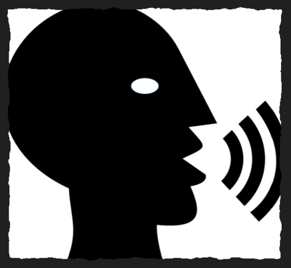

# Speech




Generate speech from a local Piper voice with `uv`:

```text
uv run speak "Hello from Piper"
```

Run `uv sync` once to create the project environment and install Piper and
`pygame`. The command uses the first-party `voices/` directory by default.
Each voice
must have both a model (`.onnx`) and its matching Piper metadata file
(`.onnx.json`). Select another model or directory as needed:

```text
uv run speak --voice other-voice "Hello"
uv run speak --no-play --output greeting.wav "Hello"
uv run speak --length-scale 2.0 "This is slower"
```

The script can also be run directly with `uv run src\speech\speak.py`, but
`uv run speak` is the recommended project command. No global Piper
installation is required.
